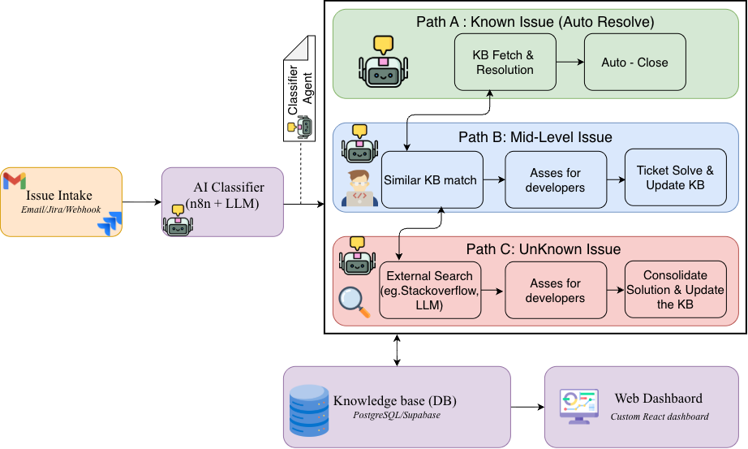

# FixFlow : Autonomous Corrective Maintenance System

> **An agentic AI operations console for real-time incident orchestration, multi-agent autonomous troubleshooting, and self-reinforcing knowledge accumulation.**

<br/>

<!-- Replace the placeholder below with your architecture diagram image -->


<br/>

---

## Table of Contents

- [Overview](#overview)
- [Live Demo](#live-demo)
- [Key Features](#key-features)
- [System Architecture](#system-architecture)
- [Agent Roster](#agent-roster)
- [Incident Lifecycle](#incident-lifecycle)
- [Scenarios](#scenarios)
- [Execution Modes](#execution-modes)
- [Terminal Interface](#terminal-interface)
- [Tech Stack](#tech-stack)
- [Getting Started](#getting-started)
- [Environment Variables](#environment-variables)
- [License](#license)

---

## Overview

FixFlow is a production-grade agentic AI system that autonomously classifies, triages, and resolves software maintenance incidents. It eliminates repetitive manual effort by routing incoming issues through a three-tier decision engine backed by semantic vector similarity search, and continuously improves itself by writing every resolved solution back into a living knowledge base.

The system is visualised through a real-time **PixiJS 2D operations floor** — a spatial representation of an engineering team where autonomous agents walk between desks, collaborate in real time, and execute remediation playbooks in full view.

**The core loop:**

```
Incident arrives → Semantic classification → Agent routing → Autonomous resolution → Knowledge writeback → Next incident resolved faster
```

---

## Live Demo
<h1>
  Known Issue
  

</h1>

<h1>
  Mid-Level Issue
 
</h1>

<h1>
  Unknown Issue
   
</h1>

<h1>
  n8n FixFlow Workflow
  

</h1>

## Key Features

- **Tri-route semantic classification** — cosine similarity over 1,536-dimensional embeddings routes every incident to the correct agent tier automatically
- **Three autonomous agent tiers** — Known (≥ 0.85), Mid-level (0.55–0.84), Unknown (< 0.55) with distinct resolution strategies per tier
- **Human-in-the-loop governance** — approval gate modal prevents unsafe automated patches on ambiguous production-critical incidents
- **Self-reinforcing knowledge base** — every resolved incident is embedded and written back to pgvector, making the next classification more accurate
- **5-point health verification** — post-patch probes confirm process alive, HTTP 200, port connectivity, error rate, and SLA latency before closing
- **PixiJS 2D operations floor** — spatial observability with agent pathfinding, desk-to-desk collaboration, and live status beacons
- **Retro CLI terminal** — `jira`, `diagnose`, `status` commands for read-only ticket inspection and floor navigation
- **Evidence provenance** — every automated action carries a full audit trail: vector match distance, executed commands, human approver sign-off
- **Dual execution modes** — zero-dependency simulation for demos, live Docker mode for production pipelines
- **Graceful failure handling** — insufficient confidence triggers `HUMAN REVIEW REQUIRED` rather than unsafe automation

---

## System Architecture

> Architecture diagram embedded below. See `docs/architecture.png` for the full-resolution export.

<!-- Replace with your actual architecture image -->
```
[ Ingestion Layer ]
  Jira Webhooks · Client Dispatch · POST /fixflow/intake
              │
              ▼
[ Semantic Engine ]
  Embedding (1536-dim) → pgvector Knowledge Index (Cosine Similarity)
              │
              ▼
[ Tri-Route Decision Engine ]
    │                  │                    │
    ▼ (≥ 0.85)         ▼ (0.55 – 0.84)      ▼ (< 0.55)
KNOWN ROUTE        MID-LEVEL ROUTE       UNKNOWN ROUTE
Auto playbook      Human approval gate   Multi-agent collab
1.88s remediation  Candidate analysis    Root-cause hypothesis
5-point verify     David review modal    Elena QA sign-off
    │                  │                    │
    └──────────────────┼────────────────────┘
                       ▼
        [ KB Writeback — Closed Learning Loop ]
                       │
                       ▼
        [ PixiJS 2D Operations Floor ]
```

---

## Agent Roster

| Pod | Agent | Role | Responsibility |
|:---|:---|:---|:---|
| Incident Command | Elena Rodriguez | Principal Commander | Global triage, emergency override, final QA sign-off |
| Backend & Core API | David Chen | Senior Backend Engineer | Known playbook execution, microservice hotfixes |
| Backend Services | Daniel Vance | Backend Associate | API gateway validation, endpoint integrity |
| Database & Cache | Arjun Mehta | Staff Database Specialist | Connection pool tuning, deadlock resolution |
| Database Infra | Sofia Silva | Data Infrastructure Engineer | Replication lag, buffer cache, disk IOPS |
| SRE & Reliability | Marcus Lee | Tier-3 Reliability Engineer | Root-cause hypothesis, distributed tracing |
| Platform Ops | Noah Kim | Site Reliability Engineer | Network probing, DNS health, container ops |
| QA & Verification | Maya Patel | QA Automation Lead | Regression suites, end-to-end service probes |
| Platform Governance | Ananya Ray | SRE Compliance Engineer | SLA validation, audit logging, change safety |
| Knowledge Systems | Priya Sharma | Knowledge Systems Curator | Vector extraction, KB enrichment, learning loop |
| External Wing | Client Visitor | Enterprise Client Rep | Dispatches urgent tickets from Reception Wing |

---

## Incident Lifecycle

Every incident advances through eight deterministic stages:

```
1. Ingest → 2. Similarity → 3. Hypothesis → 4. Playbook
                                                  │
8. KB Writeback ← 7. Resolution ← 6. Verification ← 5. Patching
```

| Stage | Name | What Happens |
|:---:|:---|:---|
| 1 | **Ingest** | Payload normalised from Jira webhook, monitoring alert, or client dispatch |
| 2 | **Similarity** | Query vector compared against pgvector store via cosine similarity |
| 3 | **Hypothesis** | LLM analyses stack traces and telemetry to generate root-cause candidates |
| 4 | **Playbook** | Matching remediation runbook selected (`VPN-AUTH-01`, `DB-POOL-RESIZE`, etc.) |
| 5 | **Patching** | Automated script execution, config rollback, or service restart applied |
| 6 | **Verification** | 5-point health probe: process alive · HTTP 200 · port open · error rate · latency |
| 7 | **Resolution** | Status → `RESOLVED`, Jira → `Done`, celebration broadcast to floor agents |
| 8 | **KB Writeback** | Resolution vector + execution summary stored in `knowledge_base` table |

---

## Scenarios

Five pre-configured scenarios demonstrate the full system capability:

### `1` — Known Incident
**`INC-1042 — VPN Gateway Authentication Timeout`** · P2 · Similarity: `0.94`

David Chen auto-remediates using playbook `VPN-AUTH-01`. All 5 health probes pass in 1.88 seconds. No human intervention required. Demonstrates maximum MTTR reduction.

---

### `2` — Mid-Level Incident
**`EPL-1067 — Database Connection Pool Exhaustion`** · P1 · Similarity: `0.78`

Falls into the human triage band. David investigates DB locks and surfaces an **Approval Gate Modal**. Once the operator approves, pool resize applies and the incident closes. Demonstrates safe human-in-the-loop control for production mutations.

---

### `3` — Unknown Novel Incident
**`EPL-1088 — Cross-Cluster Distributed Lock Deadlock`** · P1 · Similarity: `0.41`

Marcus Lee and Arjun Mehta walk to the collaboration zone, run distributed lock tracing, hypothesise lock-order inversion, and request Elena's QA sign-off. Resolution synthesises **`KB-1250`** — a new knowledge base entry. Demonstrates multi-agent cross-functional collaboration and autonomous knowledge extraction.

---

### `4` — Graceful Failure
**`EPL-1099 — Cryptographic Signature Exchange Anomaly`** · P1 · Similarity: `0.28`

Confidence too low for safe automation. FixFlow marks stage as `HUMAN REVIEW REQUIRED` and assigns Sofia and Marcus to manual forensics. Demonstrates hallucination prevention and enterprise safety resilience.

---

### `↻` — Closed-Loop Replay
Re-ingests the deadlock from Scenario 3. Because `KB-1250` was indexed, similarity jumps **`0.41 → 0.94`**. The incident now follows the Known Route and auto-resolves in seconds. Demonstrates the system demonstrably improving over time through knowledge accumulation.

---

## Execution Modes

### Simulation Mode *(default)*

Zero external dependencies. No Docker, no live Jira, no database required. Deterministic execution with full visual animations. Designed for offline demonstrations, judging, and development.

### Live Execution Mode

Full production pipeline via Docker Compose.

**Dependencies:**
- Self-hosted n8n container
- Supabase project with `pgvector` extension and `workflow_events` table
- Atlassian Jira workspace with API token

**Mechanism:**
- Subscribes to Supabase real-time websocket channel `workflow-events-realtime`
- Proxies Jira REST API via secure Next.js server-side route `/api/jira/ticket`
- Reflects live external webhook triggers directly onto the 2D operations floor

---

## Terminal Interface

Access the retro CLI via the **`>_ Terminal`** button on the operations floor.

```bash
# Retrieve ticket diagnostic card and timeline
jira EPL-1088
ticket EPL-1088

# Run full root-cause diagnostic report
diagnose EPL-1088

# List all available scenarios
scenarios

# Show system health, active mode, and floor state
status

# Clear terminal buffer
clear

# Print command reference
help
```

Every diagnostic output includes:
- Ticket summary: key, status, priority, reporter, assignee, similarity score, tri-route badge
- Numbered root-cause findings and telemetry anomalies
- Chronological event trace with provenance badges: `[JIRA]` `[FixFlow]` `[SRE]` `[QA]`
- `[ VIEW ON FLOOR ]` — loads ticket into 2D floor context without triggering re-execution

---

## Tech Stack

| Layer | Technology |
|:---|:---|
| Operations floor rendering | PixiJS 2D |
| Frontend framework | Next.js 14 |
| Workflow orchestration | n8n (self-hosted) |
| AI classification | Gemini / OpenAI Embeddings |
| Vector knowledge base | Supabase + pgvector |
| Ticketing integration | Jira Cloud REST API v3 |
| Containerisation | Docker + Docker Compose |
| Scheduling | macOS crontab / node-cron |
| Realtime events | Supabase Realtime Websockets |

---

## Getting Started

### Prerequisites

- Docker and Docker Compose
- Node.js 18+ and npm

### 1. Clone the repository

```bash
git clone https://github.com/your-username/fixflow.git
cd fixflow
```

### 2. Configure environment variables

```bash
cp .env.example .env
# Edit .env with your credentials — see Environment Variables below
```

### 3. Start the orchestration engine

```bash
docker compose up -d
```

### 4. Launch the dashboard

```bash
cd dashboard
npm install
npm run dev
```

Open [http://localhost:3000](http://localhost:3000) to access the FixFlow Autonomous Operations Floor.

### 5. Run simulation (no external dependencies needed)

On the operations floor, click any scenario button (`1 · Known`, `2 · Mid`, `3 · Unknown`, `4 · Fail`, `↻ Replay`) to begin. No Jira or Supabase connection required in simulation mode.

---

## Environment Variables

Create a `.env` file in the project root:

```env
# AI Embeddings
GEMINI_API_KEY=your_gemini_or_openai_key

# Supabase — Vector DB and Realtime
SUPABASE_URL=https://your-project.supabase.co
SUPABASE_SERVICE_KEY=your_supabase_service_role_key

# Jira Cloud — Read-only diagnostics and webhook ingestion
JIRA_BASE_URL=https://yourcompany.atlassian.net
JIRA_EMAIL=your-email@company.com
JIRA_API_TOKEN=your_atlassian_api_token
JIRA_PROJECT_KEY=MAINT
```
----
## License

MIT License — see [LICENSE](./LICENSE) for details.

---

<p align="center">
  Built with precision · Designed for autonomy · Gets smarter with every incident
  <p align="center">
  
  
  
  
  
  
  
  
  
  
</p>
</p>

