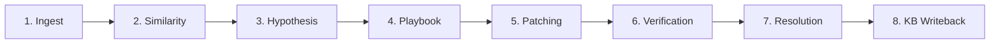

# FixFlow Dashboard — Architecture & Workflow Specification

> **Autonomous Corrective Maintenance & SRE Operations Floor**  
> *Built for the Razorpay AI Buildathon*

---

## 1. Executive Summary

The **FixFlow Dashboard** is an agentic AI operations console that unifies real-time incident orchestration, multi-agent autonomous troubleshooting, and human-in-the-loop governance.

At its core, the dashboard visualizes an active software engineering floor powered by **PixiJS 2D rendering**, modeling autonomous agents across specialized engineering pods (Backend, Database, SRE, QA, and Incident Command). The system autonomously classifies incoming alerts using vector cosine similarity, executes remediation playbooks, routes ambiguous issues through approval gates, and continuously writes newly learned solutions back into a vector knowledge base.

```
+---------------------------------------------------------------------------------------------------+
|                                      FIXFLOW ARCHITECTURE                                         |
|                                                                                                   |
|   [ Ingestion Layer ]                                                                             |
|   - Jira Webhooks                                                                                 |
|   - Client Visiting Hall                                                                          |
|   - POST /fixflow/intake                                                                          |
|              │                                                                                    |
|              ▼                                                                                    |
|   [ Semantic Engine ] ────► Embedding (1536-dim) ────► pgvector Knowledge Index (Cosine Sim)      |
|                                                                    │                              |
|                                                                    ▼                              |
|   [ Tri-Route Decision Engine ] ◄──────────────────────────────────┘                              |
|         │                                │                                │                       |
|         ▼ (≥ 0.85)                       ▼ (0.55 – 0.84)                  ▼ (< 0.55)              |
|     KNOWN ROUTE                      MID-LEVEL ROUTE                  UNKNOWN NOVEL ROUTE         |
|     - Autonomous Playbook            - Multi-Candidate Analysis       - Multi-Agent Deep Collab   |
|     - 1.88s Remediation              - Human Approval Gate            - Root-Cause Hypothesis     |
|     - 5-Point Verification           - David Review Modal             - Elena QA Verification     |
|              │                                │                                │                  |
|              └────────────────────────────────┼────────────────────────────────┘                  |
|                                               ▼                                                   |
|                        [ Closed-Loop Knowledge Writeback (KB-1250) ]                              |
|                                               │                                                   |
|                                               ▼                                                   |
|                       [ PixiJS 2D Operations Floor & Activity Feed ]                              |
+---------------------------------------------------------------------------------------------------+
```

---

## 2. PixiJS 2D Operations Floor Topography

The operations floor provides spatial observability of an engineering team. Rather than static progress bars, incidents trigger pathfinding, desk-to-desk collaboration, and visual status badges.

### 2.1 Autonomous Agent Pods & Personas

| Pod | Member | Role | Primary Responsibility |
|:---|:---|:---|:---|
| **Incident Command** | **Elena Rodriguez** | Principal Commander / Lead | Global triage, emergency override, and final QA verification. |
| **Backend & Core API** | **David Chen** | Senior Backend Engineer | Known playbook execution, microservice hotfixes, and patch deployment. |
| **Backend Services** | **Daniel Vance** | Backend Associate | API gateway traffic validation and endpoint integrity. |
| **Database & Cache** | **Arjun Mehta** | Staff Database Specialist | Connection pool tuning, query locks, and deadlock resolution. |
| **Database Infra** | **Sofia Silva** | Data Infrastructure Eng. | Replication lag inspection, buffer cache, and disk IOPS analysis. |
| **SRE & Reliability** | **Marcus Lee** | Tier-3 Reliability Engineer | Root-cause hypothesis generation, distributed tracing, and telemetry. |
| **Platform Ops** | **Noah Kim** | Site Reliability Engineer | Network socket probing, DNS health, and container orchestration. |
| **QA & Verification** | **Maya Patel** | QA Automation Lead | Automated regression test suites and end-to-end service probes. |
| **Platform Governance**| **Ananya Ray** | SRE Compliance Eng. | SLA validation, audit logging, and change-safety verification. |
| **Knowledge Systems** | **Priya Sharma** | Knowledge Systems Curator | Vector solution extraction, KB enrichment, and continuous learning. |
| **External Wing** | **Client Visitor** | Enterprise Client Rep | Dispatches urgent maintenance tickets from the Reception Wing. |

### 2.2 Floor Zones & Landmarks
1. **Reception & Client Visiting Hall (Left Wing)**: Includes the Client Desk, visiting chairs, and an animated envelope dispatch mechanic (`sendClientMail`) representing incoming enterprise client tickets.
2. **Engineering Pod Clusters (Center)**: Desk stations with dual monitors, swivel chairs, and status LED beacons.
3. **DevOps Server Rack Wing (Top Center)**: Dynamic blinking LED server racks (`devops_infra`) that indicate CPU and memory load spikes.
4. **Collaboration Area (Bottom Center)**: A dedicated meeting and whiteboard area where agents walk to execute cross-pod investigations.

---

## 3. The 8-Stage Incident Lifecycle Pipeline

Every incident processed by FixFlow advances through eight deterministic lifecycle stages:



### Stage Breakdown
1. **`ingest` (Incident Intake)**: Payload validated via Jira webhook, monitoring alert, or internal client dispatch. Normalized to `{ id, title, service, priority, raw_logs }`.
2. **`similarity` (Semantic Search)**: Query vector generated and compared against pgvector knowledge store using cosine similarity (`1 - (embedding <=> query)`).
3. **`hypothesis` (AI Diagnostic Engine)**: For non-trivial incidents, the LLM analyzes stack traces, error codes, and telemetry to generate root-cause hypotheses.
4. **`playbook` (Remediation Matching)**: Selects matching remediation runbook (e.g., `VPN-AUTH-01`, `DB-POOL-RESIZE`, `DEADLOCK-BREAK-TX`).
5. **`patching` (Execution & Deployment)**: Automated script execution, configuration rollback, or service restart applied to target pods.
6. **`verification` (5-Point Health Probe)**:
   * **Probe 1**: Service process alive.
   * **Probe 2**: HTTP health endpoint returns `200 OK`.
   * **Probe 3**: Port connectivity (e.g., port `5432` for PostgreSQL).
   * **Probe 4**: Error rate dropped below 0.01%.
   * **Probe 5**: SLA latency restored within target threshold (< 200ms).
7. **`resolution` (Incident Closure)**: Status transitioned to `RESOLVED`, Jira ticket marked `Done`, and celebration broadcast sent to floor agents.
8. **`kb_writeback` (Continuous Learning)**: New resolution vector, execution summary, and author metadata stored in `knowledge_base` table.

---

## 4. Scenario Simulation Engine

The dashboard features five pre-configured scenarios accessible from the floor control bar:

### Scenario 1: Known Incident (`1 · Known`)
* **Incident**: `INC-1042 — VPN Gateway Authentication Timeout`
* **Severity**: `P2` | **Initial Similarity**: `0.94`
* **Behavior**: Full autonomous remediation. David Chen alerts immediately, walks to the server rack, applies playbook `VPN-AUTH-01`, passes health probes in `1.88s`, and celebrates.
* **Key Demonstration**: Extreme MTTR reduction without requiring human intervention.

### Scenario 2: Mid-Level Incident (`2 · Mid`)
* **Incident**: `EPL-1067 — Database Connection Pool Exhaustion`
* **Severity**: `P1` | **Initial Similarity**: `0.78`
* **Behavior**: Ambiguous similarity falls into human triage band ($0.55 \le \text{score} < 0.85$). David investigates DB locks and opens an interactive **Developer Approval Gate Modal**. Once the human operator clicks **Approve**, the pool resizing patch applies, verification completes, and the incident closes.
* **Key Demonstration**: Safe human-in-the-loop control for production-critical mutations.

### Scenario 3: Novel Unknown Incident (`3 · Unknown`)
* **Incident**: `EPL-1088 — Cross-Cluster Distributed Lock Deadlock`
* **Severity**: `P1` | **Initial Similarity**: `0.41`
* **Behavior**: Low similarity prevents automated playbook execution. Marcus Lee (SRE) and Arjun Mehta (DB) walk to the collaboration area, run distributed lock tracing, hypothesize lock-order inversion, and dispatch Elena Rodriguez for QA sign-off. Elena approves, patch applies, and the system synthesizes **`KB-1250`**.
* **Key Demonstration**: Multi-agent cross-functional synthesis and autonomous knowledge extraction.

### Scenario 4: Graceful Failure (`4 · Fail`)
* **Incident**: `EPL-1099 — Anomaly in Cryptographic Signature Exchange`
* **Severity**: `P1` | **Initial Similarity**: `0.28`
* **Behavior**: Confidence is too low to safely automate (`INSUFFICIENT EVIDENCE`). FixFlow refuses blind automation, marks stage as `HUMAN REVIEW REQUIRED`, and assigns Sofia & Marcus to conduct manual forensics.
* **Key Demonstration**: Hallucination-prevention and safety-first enterprise resilience.

### Scenario 5: Closed-Loop Replay (`↻ Replay`)
* **Incident**: Re-ingests the exact deadlock from Scenario 3 (`EPL-1088`).
* **Behavior**: Because `KB-1250` was generated and indexed, the similarity score jumps from **`0.41` $\rightarrow$ `0.94`**. The incident now follows the **Known Route** and auto-resolves in seconds.
* **Key Demonstration**: The system demonstrably gets smarter over time.

---

## 5. Dual Execution Modes

The dashboard supports two interchangeable execution modes via the floor control bar toggle:

### 5.1 Simulation Mode (Default)
* **Target Audience**: Demonstrations, buildathon judging, and offline testing.
* **Dependencies**: Zero external dependencies (no Docker, no live Jira, no live databases required).
* **Guarantees**: Deterministic execution, immediate response times, complete visual animations, and safety against network dropouts.

### 5.2 Live Execution Mode
* **Target Audience**: Production environments and live Docker pipeline integration.
* **Dependencies**:
  * Self-hosted n8n container (`docker compose up -d`).
  * Supabase project with `pgvector` extension and table `workflow_events`.
  * Atlassian Jira workspace with API token.
* **Mechanism**:
  * Subscribes to Supabase real-time websocket channel `workflow-events-realtime`.
  * Polls and proxies Jira REST API via secure Next.js server-side route `/api/jira/ticket`.
  * Reflects actual external webhook triggers directly onto the 2D floor.

---

## 6. Read-Only JIRA Diagnostic Terminal

The dashboard includes a retro hacker CLI accessible via the **`>_ Terminal`** button.

### Supported Commands

| Command Syntax | Description |
|:---|:---|
| `jira <TICKET_ID>` | Retrieves diagnostic card and timeline for the ticket. |
| `ticket <TICKET_ID>` | Alias for `jira <TICKET_ID>`. |
| `diagnose <TICKET_ID>` | Runs full diagnostic report on the ticket. |
| `scenarios` | Lists all 5 guided demonstration scenarios. |
| `status` | Shows system health, active mode, and floor state. |
| `clear` | Clears terminal scroll buffer. |
| `help` | Prints available command reference. |

### Diagnostic Output Structure
1. **Summary Header**: Ticket key, status, priority, reporter, assigned agent, similarity score, and tri-route decision badge.
2. **Diagnostic Findings**: Numbered root cause observations and telemetry anomalies.
3. **Chronological Timeline**: Ordered event trace with provenance source badges (`[JIRA]`, `[FixFlow]`, `[SRE]`, `[QA]`).
4. **Interactive Action**: `[ VIEW ON FLOOR ]` button loads the ticket directly into the 2D floor context for visual analysis without triggering destructive loops.

---

## 7. Evidence Provenance & Inspectability

To maintain audit compliance, every action taken by an agent can be traced back to raw data:

* **Live Activity Panel**: Dual-tab drawer providing both an instant chronological event feed and an **Evidence Provenance Tab**.
* **Provenanced Telemetry**: Stack traces, error logs, vector match distances, executed bash/Ansible commands, and human approver sign-offs are captured in real-time.
* **Human Drawer**: Clicking any agent on the floor reveals their current active incident, state history, assigned tasks, and performance metrics.

---

## 8. Docker Deployment & Local Setup

### 8.1 Prerequisites
* Docker & Docker Compose
* Node.js 18+ & npm

### 8.2 Environment Configuration
Create `.env` in the root directory:
```env
# AI & Vector Embeddings
GEMINI_API_KEY=your_gemini_or_openai_key

# Supabase Database & Realtime
SUPABASE_URL=https://your-project.supabase.co
SUPABASE_SERVICE_KEY=your_supabase_service_role_key

# Jira Cloud Integration (Read-Only Diagnostics & Webhooks)
JIRA_BASE_URL=https://yourcompany.atlassian.net
JIRA_EMAIL=your-email@company.com
JIRA_API_TOKEN=your_atlassian_api_token
JIRA_PROJECT_KEY=MAINT
```

### 8.3 Starting the Full Stack
```bash
# 1. Start the n8n orchestration engine
docker compose up -d

# 2. Launch the Next.js interactive dashboard
cd dashboard
npm install
npm run dev
```
Open **`http://localhost:3000`** to access the FixFlow Autonomous Operations Floor.
